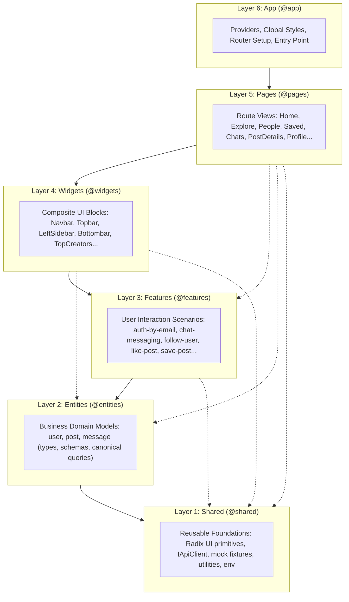
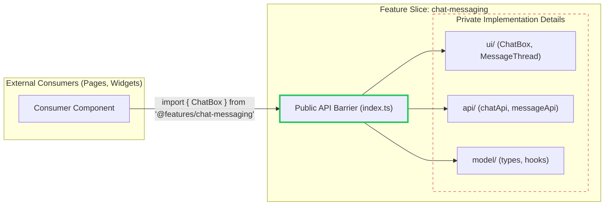
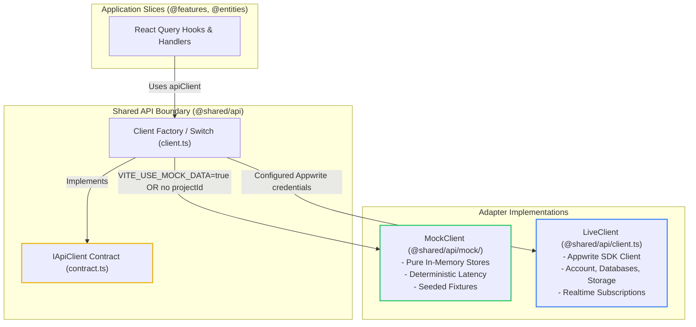

# Modern Snapgram Architecture Specification
## Feature-Sliced Design (FSD) v2.1 Reference Guide

- **Architectural Standard**: Feature-Sliced Design (FSD) v2.1
- **Target System**: Modern Snapgram
- **Date**: September 2026
- **Status**: Production Verified

---

## 1. Architectural Overview & Philosophy

Modern Snapgram was migrated from an unconstrained feature-folder architecture plagued by circular dependencies, mixed concerns, and untyped state into **Feature-Sliced Design (FSD) v2.1**.

FSD solves the scalability challenges of modern single-page applications by enforcing:
1. **Explicit Layer Hierarchy**: Code is divided into 6 standardized layers with strict vertical responsibilities.
2. **Unidirectional Dependency Flow**: A layer may only import from layers strictly below it. Circular or upward dependencies are compile-time forbidden.
3. **Public API Contracts**: Every slice exposes a single `index.ts` barrier. Internal implementation details (`model/`, `ui/`, `api/`) are private.
4. **Domain Decoupling**: Business domain logic lives inside isolated entities, user interactions inside features, and complex composite blocks inside widgets.

---

## 2. Layer Hierarchy & Responsibilities



### Detailed Layer Breakdown

| Layer | Responsibility | Directory Path | Allowed Imports From |
| :--- | :--- | :--- | :--- |
| **`app`** | App initialization, global providers (`QueryProvider`, `AppProviders`), routing table (`AppRoutes`), authentication guards (`AuthGuard`), and global styles (`global.css`). | `src/app/` | `pages`, `widgets`, `features`, `entities`, `shared` |
| **`pages`** | Composed route-level views mapping 1:1 to application URLs (`HomePage`, `ExplorePage`, `ChatsPage`, etc.). Contains zero direct low-level API queries; delegates to widgets and features. | `src/pages/` | `widgets`, `features`, `entities`, `shared` |
| **`widgets`** | Self-contained, multi-feature UI assemblies that provide cohesive interface sections (`LeftSidebar`, `Topbar`, `Bottombar`, `TopCreators`, `PostMediaCarousel`). | `src/widgets/` | `features`, `entities`, `shared` |
| **`features`** | Interactive user capabilities that drive business value (`auth-by-email`, `chat-messaging`, `follow-user`, `like-post`, `save-post`, `search-posts`, `manage-post`, `update-profile`). | `src/features/` | `entities`, `shared` |
| **`entities`** | Core business domain representations (`user`, `post`, `message`). Encapsulates canonical entity types, React Query cache queries, and atomic entity presentation components (`UserCard`, `PostCard`). | `src/entities/` | `shared` |
| **`shared`** | Completely domain-agnostic building blocks. Contains headless Radix UI components, utility functions (`date`, `debounce`), environment schema, and the `IApiClient` contract with mock fixtures. | `src/shared/` | *None (Self-contained)* |

---

## 3. Public API Enforcement Pattern

Under FSD v2.1, modules must never reach into private internal directories of other slices (e.g. `import { x } from '@features/chat-messaging/ui/internal/MessageList'`). Instead, each slice defines a strict boundary via `index.ts`.



### Public API Rules
1. **Barrel Boundary**: Only symbols re-exported by `index.ts` are accessible outside the slice.
2. **Refactoring Isolation**: Internal reorganization of files within a slice has zero ripple effect on other slices as long as the public API contract is preserved.
3. **No Cross-Slice Contamination**: Slices on the same layer cannot import from one another. For example, `@features/like-post` cannot import from `@features/save-post`. If two features share logic, that logic must be extracted down to `@entities` or `@shared`.

---

## 4. Offline Mock Adapter Architecture

A critical architectural achievement in Modern Snapgram is the complete decoupling of the UI from cloud infrastructure via the **Client Adapter Pattern**.



### Mechanics:
1. **Interface Definition (`contract.ts`)**: Defines typed contracts for `auth`, `users`, `posts`, `saves`, and `chats`.
2. **Runtime Determination**:
   ```ts
   const useMock = import.meta.env.VITE_USE_MOCK_DATA === 'true' || !appwriteConfig.projectId
   export const apiClient: IApiClient = useMock ? mockClient : liveClient
   ```
3. **Zero Configuration Execution**: Developers or reviewers can clone the repository, run `pnpm dev` or `pnpm build`, and interact with a fully functioning social network without provisioning an Appwrite instance or filling `.env` secrets.

---

## 5. Architectural Quality Attributes Summary

- **McCabe Cyclomatic Complexity**: $M \le 10$ across all hooks and functions.
- **Maximum Indentation Depth**: $\le 2$ levels.
- **Fail-Fast Guard Clauses**: Validations precede logic at routine entry points.
- **Type Safety**: Pure TypeScript with 0 `any` types.
- **Vendor Chunking**: Clean isolation of `react-vendor`, `ui-vendor`, `query-vendor`, and `appwrite-vendor`.
